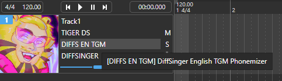

# DIFFS EN TGM
<p align="center">
  tigermeat's custom English DiffSinger Phonemizer for OpenUTAU<br><br>
  
</p>

## How to Install

Download `diffs_en_tgm.dll` from [this](https://github.com/spicytigermeat/tigermeat_en_ds_phonemizer/releases/download/v1.0.0/diffs_en_tgm.dll) link, and put the file in the `Plugins` folder of your version of OpenUTAU.

This phonemizer looks for `dsdict-en-tgm.yaml` to load phonemes, grapheme overrides and phoneme replacements.

## Differences from `DIFFS EN`

- includes the following phonemes: `tr` `dr` `ax` `dx`

## Usage

You may distribute this with your DiffSinger libraries, so long as proper credit is given! You may copy paste this into any 'readme' you may have if you would like, otherwise just mentioning "DIFFS EN TGM by tigermeat" and linking to this repo is fine.
```
DIFFS EN TGM Phonemizer by tigermeat
https://github.com/spicytigermeat/tigermeat_en_ds_phonemizer
```

## Future plans

- Improve G2p model to include more specific accent things for a more casual, singing style of English pronunciation, like including `q` for glottal stops and such.
